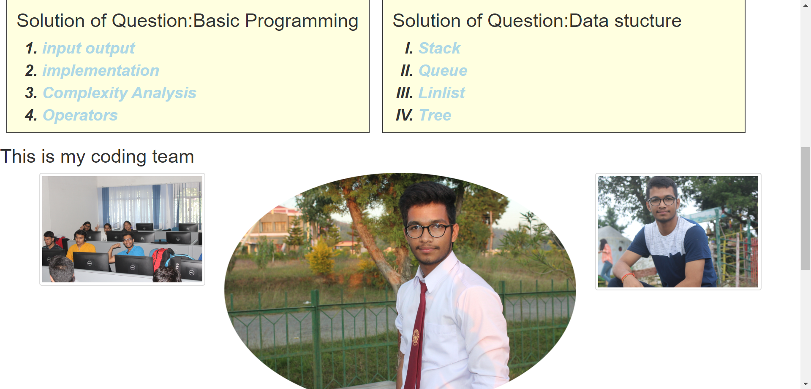
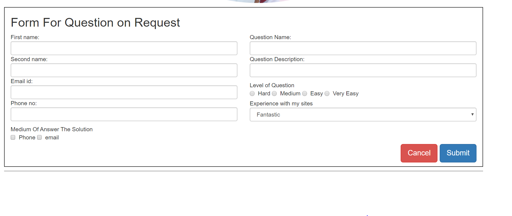
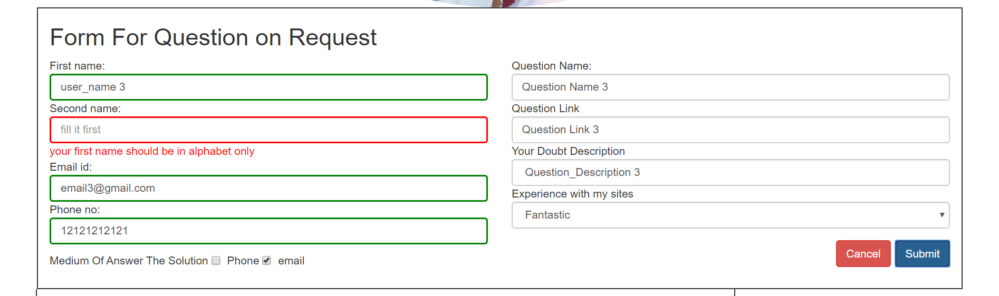
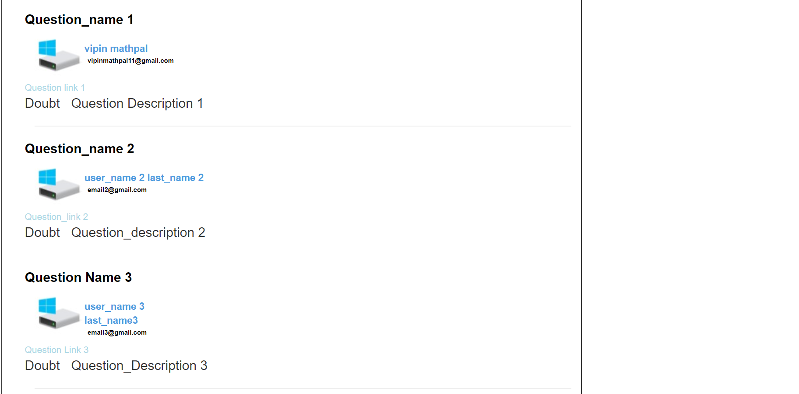

    
   #### HTML
   #### CSS ,BOOTSTRAP
   #### JAVASCRIPT
   #### PHP
   
   ## Navbar & BG_IMAGE
   
   ## PHTOTO 
   
   ## FROM 
   Form to Enter user Question_request
   
  ## Regular Expression  (validation)
  
  ## ASKED QUESTION
  
